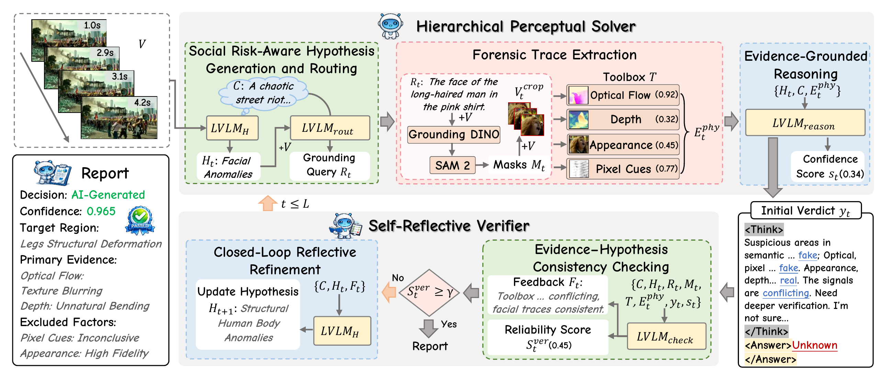

<p align="center">
  
</p>

<h1 align="center">SafeGuard</h1>

<h3 align="center">
  A Multi-Agent Perception-Reasoning Framework for Social-Risk AI-Generated Video Detection
</h3>

<p align="center">
  <a href="ECCV_2026_SafeGuard.pdf">
    
  </a>
  <a href="ECCV_2026_SafeGuard_supplementary_material.pdf">
    
  </a>
  <a href="https://williamw99.github.io/safeguard/">
    
  </a>
  <a href="https://github.com/williamw99/SafeGuard">
    
  </a>
  
</p>

<p align="center">
  <b>Wenlin Wu</b><sup>*1</sup>,
  Sheng Zhou<sup>*2</sup>,
  Peipei Song<sup>1</sup>,
  Wenhao Wang<sup>3</sup>,
  Junbin Xiao<sup>1&dagger;</sup>,
  Xun Yang<sup>1&dagger;</sup>
</p>

<p align="center">
  <sup>1</sup>University of Science and Technology of China &nbsp;
  <sup>2</sup>King Abdullah University of Science and Technology &nbsp;
  <sup>3</sup>Vast Intelligence Lab
</p>

<p align="center">
  <sup>*</sup>Equal contribution &nbsp;&nbsp; <sup>&dagger;</sup>Corresponding authors
</p>

---

## News

- **2026.06** SafeGuard was accepted to ECCV 2026.

## Overview

SafeGuard is proposed for social-risk AI-generated video detection, bridging forensic perception and semantic reasoning.

## Highlights

- Multi-agent detection framework for trustworthy AIGC video analysis.
- SafeVid benchmark and code will be released soon.
- Strong results on SafeVid and public AI-generated video benchmarks.

## SafeVid Benchmark

The SafeVid dataset will be released soon.

## Method

<p align="center">
  
</p>

## Results

Main results of SafeGuard with the GPT-4o solver setting:

| Benchmark | Accuracy (%) | F1 (%) |
| --- | ---: | ---: |
| SafeVid ID | 93.0 | 90.7 |
| SafeVid OOD | 80.1 | 72.8 |
| SafeVid Avg. | 85.5 | 80.9 |
| GenVideo | 97.9 | 95.6 |
| DVF | 97.0 | 93.2 |
| LOKI | 81.7 | 77.7 |
| GenVidBench | 84.6 | 85.1 |
| Overall Avg. | 89.3 | 86.5 |

Compared with previous state-of-the-art methods, SafeGuard improves accuracy by **+6.9** points on DVF, **+11.7** points on LOKI, and **+13.2** points on GenVidBench.

## Repository Status

Upcoming releases:

- [ ] SafeVid dataset release
- [ ] SafeGuard code release
- [ ] Pre-trained checkpoints release

## Citation

If you find this work useful, please consider citing:

```bibtex
@inproceedings{wu2026safeguard,
  title     = {SafeGuard: A Multi-Agent Perception-Reasoning Framework for Social-Risk AI-Generated Video Detection},
  author    = {Wu, Wenlin and Zhou, Sheng and Song, Peipei and Wang, Wenhao and Xiao, Junbin and Yang, Xun},
  booktitle = {European Conference on Computer Vision (ECCV)},
  year      = {2026}
}
```

## Acknowledgements

We thank the authors and maintainers of the public benchmarks, codebases, and foundation tools that support this work, including [GenVideo / DeMamba](https://github.com/chenhaoxing/DeMamba), [DVF](https://github.com/SparkleXFantasy/MM-Det), [LOKI](https://github.com/opendatalab/LOKI), [GenVidBench](https://genvidbench.github.io/), [Grounding DINO](https://github.com/IDEA-Research/GroundingDINO), [SAM 2](https://github.com/facebookresearch/sam2), [RAFT](https://github.com/princeton-vl/RAFT), [Depth Anything V2](https://github.com/DepthAnything/Depth-Anything-V2), [DINOv2](https://github.com/facebookresearch/dinov2), and [D3](https://github.com/Zig-HS/D3). We also thank the developers of the video generation models used to construct SafeVid.

## Contact

For questions about the paper, dataset, or code release, please contact:

- Wenlin Wu: <wenlin097@mail.ustc.edu.cn>
